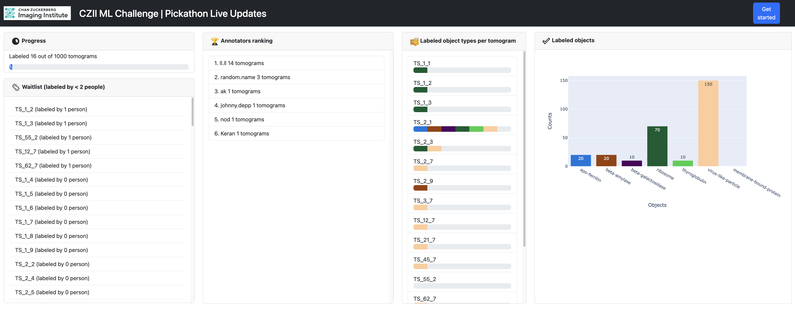
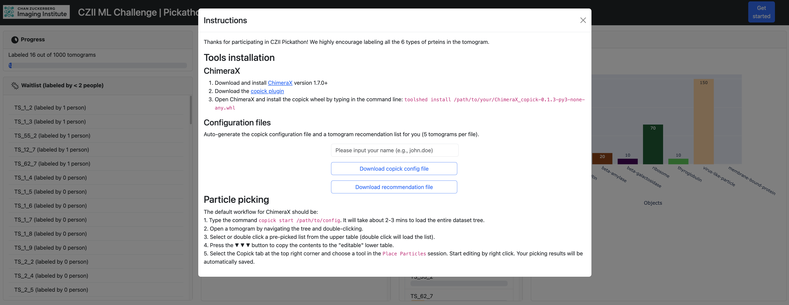

# copick\_live\_vis
A Dash Plotly server visualizing CZII ML challenge pickathon with live updates.  


## Usage
Installation: `pip install -r requirements.txt`.   

A copick configuration file and a json checkpoint file are needed, see example below:

**A copick configuration json file template**  
See [copick example](https://github.com/uermel/copick).

**A json checkpoint file**     
An example:  
```
{  
    "start": 5,  
    "repeat": 1,  
    "tasks_per_person": 5  
}  
``` 

1. Edit the `conifg.ini` file.  
2. Run `python app.py` in the correct Python environment. Access the website at `http://localhost:8000` in the browser.

## GUI


